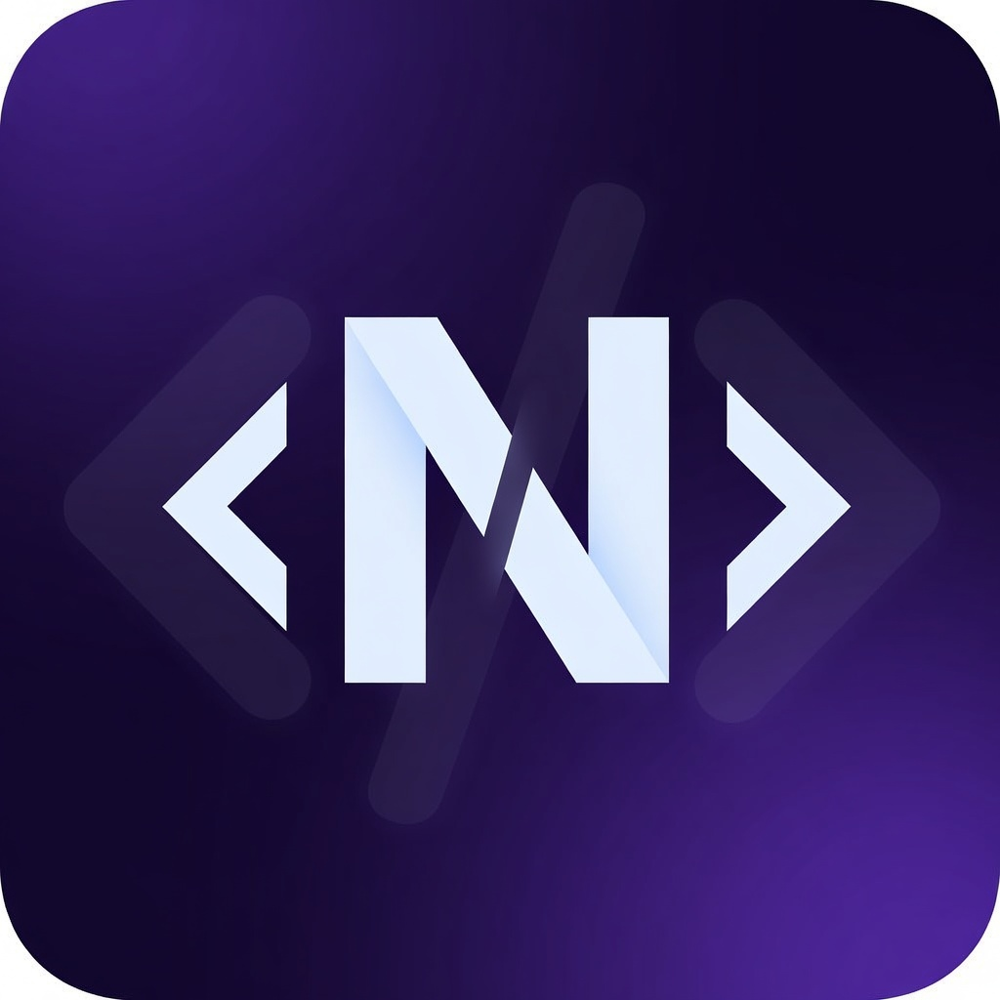

# NimoteCode

  

<h3 align="center">Code anywhere. Ship everywhere.</h3>

  The professional mobile IDE. Full SSH, Git, AI, and Debug, optimized for iPhone, iPad, and Android.

  <strong>Supports iOS and Android</strong> · App Store and Google Play release in progress

  <a href="https://nimotecode.com"><strong>Official Website</strong></a>
  ·
  <a href="https://nimotecode.com/download"><strong>Download</strong></a>
  ·
  <a href="https://nimotecode.com/docs/quick-start"><strong>Documentation</strong></a>
  ·
  <a href="https://x.com/nimotecode"><strong>X</strong></a>
  ·
  <a href="https://github.com/nimotecode/nimote_issues/issues"><strong>Issues</strong></a>

---

## Overview

NimoteCode turns your phone or tablet into a practical coding workspace. Connect to local or SSH workspaces, edit files, run commands, review Git changes, use AI assistance, debug issues, and ship fixes without reaching for a laptop.

Everything is designed around real mobile development workflows: focused panels, persistent terminal sessions, SSH reconnection, AI-assisted automation, and iPad-friendly workspace layouts.

## Preview

  
  
  

### iPad Workspace

  
  

<!--
Demo video can be added here later.
Recommended format:

  

-->

## Features

| Feature | Description |
| --- | --- |
| **SSH Workspace** | Connect to real servers with heartbeat monitoring, auto-reconnection, and remote file access. |
| **Terminal** | Run persistent terminal sessions, search output, and execute frequent commands faster. |
| **Editor** | Edit code with syntax highlighting, outline navigation, find/replace, and symbol search. |
| **Git Source Control** | Review diffs, stage changes, commit, branch, stash, sync, and use Git AI. |
| **AI Chat & Agent** | Explain code, refactor files, automate tasks, and keep workspace-aware memory. |
| **LSP & Debug** | Use diagnostics, code actions, breakpoints, call stack, variables, and watches. |
| **Tasks & Timeline** | Run repeatable tasks, trace events, and analyze issues with AI-assisted root-cause workflows. |
| **Sync / Cache** | Sync local and remote files with safer path handling and operation history. |

## High-Value Scenarios

| Scenario | Workflow |
| --- | --- |
| **Remote hotfix** | Connect over SSH, edit files, run terminal commands, review changes, and commit the fix. |
| **On-call triage** | Inspect logs, check diagnostics, trace timeline events, and identify likely root causes faster. |
| **AI-assisted coding** | Ask questions, explain unfamiliar code, generate changes, and automate repetitive steps. |
| **Server maintenance** | Manage SSH profiles, run saved commands, update configs, and keep terminal sessions persistent. |
| **iPad development** | Use a larger workspace for Git, terminal, editor, and debugging workflows on the go. |

## Free And Pro

Start free with the essentials for mobile development. Upgrade to Pro when you need deeper Git, debugging, language tooling, and sync workflows.

| Capability | Free | Pro |
| --- | :---: | :---: |
| SSH workspace and auto-reconnection | Yes | Yes |
| Editor, terminal, search, and tasks | Yes | Yes |
| AI Chat and Timeline analysis | Yes | Yes |
| Git Source Control and Git AI |  | Yes |
| LSP diagnostics and code actions |  | Yes |
| Full debugger |  | Yes |
| Multi-terminal support |  | Yes |
| Local / remote sync |  | Yes |

## Availability

NimoteCode supports **iOS** and **Android**. Store release is currently in progress.

| Platform | Status |
| --- | --- |
| **iOS** | App Store listing in progress |
| **Android** | Google Play listing in progress |

Download links will be added when the store pages are live.

## Links

- Website: https://nimotecode.com
- Download: https://nimotecode.com/download
- Documentation: https://nimotecode.com/docs/quick-start
- X: https://x.com/nimotecode
- Issues: https://github.com/nimotecode/nimote_issues/issues
- Email: nimotecode@gmail.com

## Keywords

mobile IDE, SSH client, remote development, code editor, iOS app, Android app, Flutter app, Rust backend, developer tools
